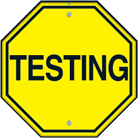

<link rel="stylesheet" href="assets/style.css">

# 👋 Hi, I'm CVillar

I'm a **data specialist** focused on **data management for the mining industry**, **geospatial analysis**, and **process automation**. I build tools and dashboards that transform raw data into actionable insights.

---

## 🛠 Featured Projects

---

### 🧭 Tech Treasures Challenge – Critical Minerals Exploration Dashboard  

A geospatial dashboard and predictive modeling tool for rare earth element (REE) exploration in British Columbia.  
Developed for the [Tech Treasures Challenge](https://getech.com/news/getech-collaborates-with-thinkonward-to-develop-ai-powered-critical-minerals-exploration-dashboard).

More about this project

- Explores geospatial and geochemical features for REE mineralization.  
- Built Random Forest models with resampled raster inputs and categorical targets.  
- Implemented PCA and clustering (K-Means), with final results visualized in a Streamlit dashboard.  
- The pipeline includes data cleaning, raster processing, and a prospectivity map.

<a href="https://github.com/cvillarragamo/Tech_Treasures_Challenge" target="_blank">
  <button>View on GitHub</button>
</a>

---

### ⚒️ Mining Transport Performance Analysis  

A technical evaluation of equipment productivity in a mining operation based on daily tonnage moved and number of loading events.

More about this project

- Built a dashboard to visualize performance by shovel and transport unit.  
- Identified key variables influencing extraction performance.  
- Proposed actionable recommendations to improve operational efficiency.  
- Conducted EDA, feature importance analysis, and model-based insights using Python and Streamlit.

<a href="https://github.com/cvillarragamo/andesite" target="_blank">
  <button>View on GitHub</button>
</a>

---

### 🚲 Bike Rental Demand Prediction  

Machine learning project to forecast bike rental demand during a 4-day datathon at Henry Data Science Bootcamp.

More about this project

- Explored predictors like temperature, humidity, hour, and season.  
- Compared Decision Tree, Random Forest, and Ridge Regressor using GridSearchCV.  
- Applied feature binning to reduce noise and overfitting.  
- Random Forest model showed the best performance despite binning-induced overfitting.

<a href="https://github.com/cvillarragamo/Datathon_Bootcamp_Henry_BikeRental_ML" target="_blank">
  <button>View on GitHub</button>
</a>

---

## 📬 Contact

- 📧 [you@example.com](mailto:you@example.com)  
- 🧑‍💻 [@cvillarragamo](https://github.com/cvillarragamo)

---

<footer style="margin-top: 40px; text-align: center; color: #888;">
  
©  CVillar • Powered by GitHub Pages

  
</footer>
